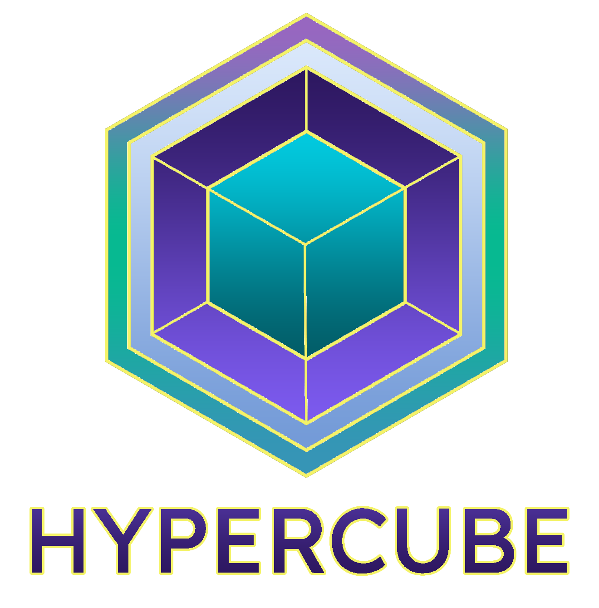
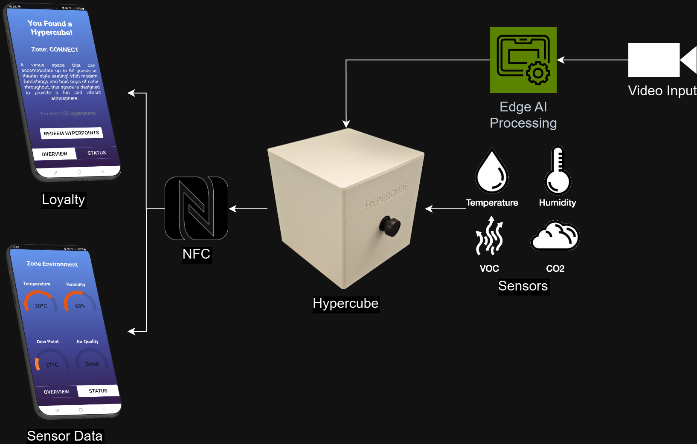

# Hypercube

AI-powered security that boost safety, cost savings abd engagement.

# Fastlinks:

Hi!, if you are a judge and want to review the code here are the links:

### **Web Page**: [OPEN CODE](./hypercube-webapp/)
### **Hypercube Code**: [OPEN CODE](./workspace/)
### **Video Demo**: [OPEN DEMO](https://youtu.be/D6IDM0J6fAc)

# Introduction:

In industries where security is critical, managing costs without compromising safety is a constant challenge. AI-powered security systems offer a game-changing solution by using machine learning and real-time data to optimize surveillance and monitoring processes. These intelligent systems not only enhance safety but also streamline operations, significantly reducing expenses related to manual monitoring, equipment maintenance, and response times. By automating threat detection and minimizing resource use, AI-driven security ensures a safer environment at a fraction of traditional costs.

# Problem:

Traditional security systems are expensive to operate due to high labor demands, resource inefficiencies, and outdated technology that requires constant maintenance. These costs quickly add up, especially in environments that require 24/7 monitoring. Moreover, reactive measures lead to increased expenses from delayed responses and unnecessary resource use. There’s a critical need for a cost-effective, optimized solution that leverages AI to automate threat detection, reduce manual oversight, and ultimately save money while enhancing security.

# Solution: 

# Diagram and Summary:

The general diagram of our solution is as follows, this is a summary of the technologies.

### Hardware (Hypercube)
- **Jetson Nano Orin 8GB**: Compact AI computing platform for real-time machine learning.
- **Xiao SAMD21**: Low-power microcontroller for IoT, ARM Cortex-M0+ based.
- **SGP30 - Gas Sensor**: Detects VOCs and CO2 for air quality monitoring.
- **SHT40 - Temp and Hum Sensor**: High-accuracy temperature and humidity sensor.
- **Buzzer**: Audio alert device.
- **NeoPixel Matrix 4x4**: Programmable 4x4 RGB LED matrix.
- **WebCam**: Camera for video capture and computer vision tasks.

### Software
- **NextJS**: Framework for fast, server-rendered React apps.
- **Jetpack 6.0**: OS optimized for Nvidia Jetson Nano, with deep learning libraries.
- **YoloV8**: Real-time object detection model.
- **NanoOWL**: Lightweight ML framework for low-power devices.
- **Mediapipe**: Framework for face, hand, and pose tracking.
- **Docker**: Container platform for consistent app deployment.

### Cloud
- **Google Cloud**: Platform for scalable storage, compute, and processing.
  - **Cloud Functions**: Serverless code execution for event-driven tasks.
  - **Firestore DB**: Real-time NoSQL database.
- **Vercel**: Deployment platform optimized for front-end and serverless apps.